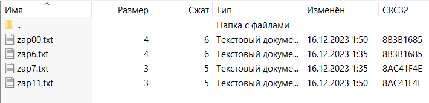
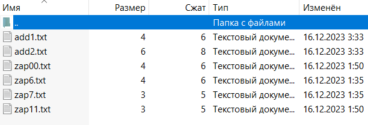
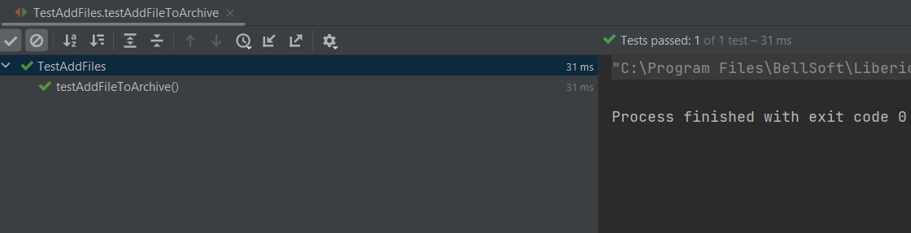

# Работа с архивами Java

### Задание

Нужно добавить несколько файлов в существующий архив.

----------

### Решение

Так как в java стадарнатном пакете java.util.zip не предусмотрено запись файлов в существующий архив (При записи файлов в существующий архив с помощью ZipOutputStream архив просто перезаписывается, и данные которые в нем были теряются).
Поэтому нужно немного пойти на хитрость, и для решения задачи я использовал промежуточный архив. Сначала я создаю новый массив, и записываю в него объекты существующего архива. И только после этого я записываю файлы которые нужно было добавить.
В самом конце я удаляю старый файл, и предаю название старого файла к новому.
Решение находится в паке homework в классе Main.

-----------

### Вывод

Архив до изменения

И после работы программы

------

### Тесты

Мы проверяем добавились ли наши файлы, извлекаем файлы из архива и проверяем существуют ли они, и после этого удаляем

